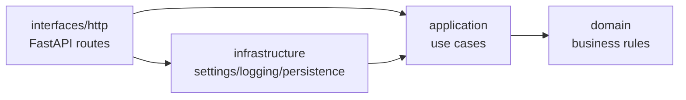
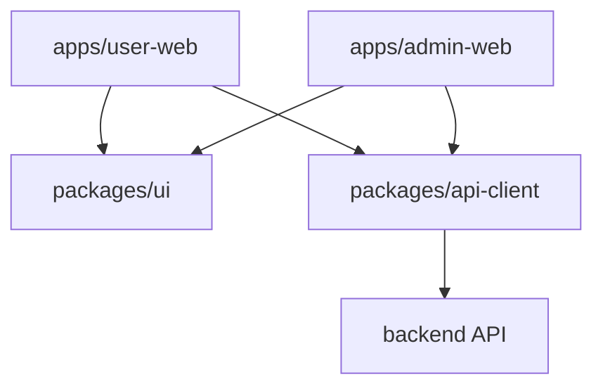

# Architecture

SheepParter 采用前后端分离结构：后端负责业务能力与 API，前端拆分为用户端与管理员端，并通过共享包复用通用 UI（用户界面）与 API client（接口客户端）。

## Backend

后端采用 Clean Architecture（整洁架构），依赖只能从外层指向内层：

层级职责：

- `domain`：业务实体、值对象、业务规则；不依赖 FastAPI、数据库或第三方 SDK。
- `application`：用例编排、输入输出边界、事务边界的抽象。
- `infrastructure`：配置、日志、数据库、缓存、外部服务等技术实现。
- `interfaces`：HTTP/API、CLI、message consumer（消息消费者）等入口适配。

当前 database（数据库）实现使用 SQLite + SQLAlchemy，并由 Alembic 管理 migration（迁移）。业务用例只依赖 repository protocol（仓储协议），数据库连接与 ORM（对象关系映射）细节留在 `infrastructure`，便于后续替换为更适合持续运行的数据库。

## Frontend

前端使用 npm workspaces（工作区）组织：

约束：

- 应用只负责页面、路由、状态装配与产品流程。
- 共享 UI 只沉淀跨端复用且稳定的基础组件。
- API client 只处理请求封装、类型定义和错误归一，不承载页面逻辑。

## Skills

`skills/` 是用户提供的 agent skills（智能体技能）素材，主要用于前端设计、品牌、图像与输出质量控制。它不是运行时代码，也不应被构建脚本隐式消费。需要设计能力时，由 agent 按任务显式读取相关 `SKILL.md`。
